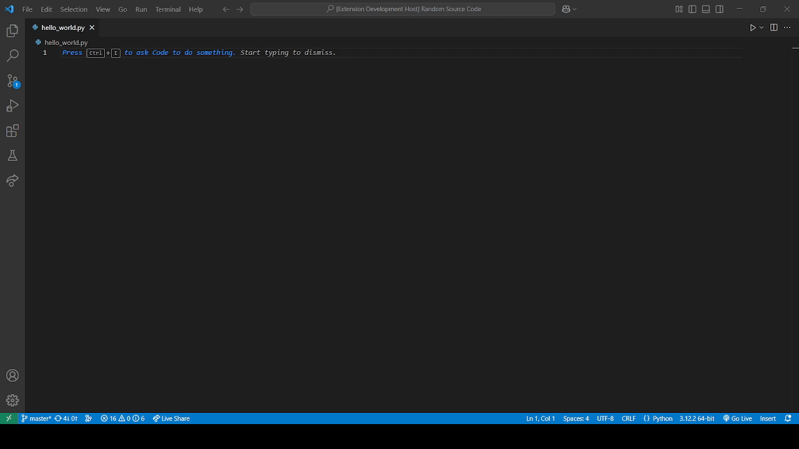

# NeuroPilot



This extension lets Neuro-sama suggest code for you similar to GitHub Copilot.
If you don't have a Neuro-sama, you can use tools like [Randy](https://github.com/VedalAI/neuro-game-sdk/tree/main/Randy), [Tony](https://github.com/Pasu4/neuro-api-tony) or [Jippity](https://github.com/EnterpriseScratchDev/neuro-api-jippity).
If you are using Tony, activating auto-answer is recommended, since completion requests are canceled if you click out of VS Code.

This extension **will**:

- let Neuro make inline code suggestions.
- add Neuro as a chat participant for Copilot Chat.

If you enable it, this extension **can**:

- let Neuro edit the current file.
- let Neuro read and open files in the workspace.
- let Neuro create, rename and delete files in the workspace.
- let Neuro run pre-defined tasks.
- let Neuro interact with the git repository, if one is present in the open workspace.
- let Neuro view linting diagnostics, and be updated on linting diagnostics as they come in.

This extension **will not**:

- let Neuro read what you type in real time, unless you enable it in the settings.
- give Neuro direct terminal access, unless you enable it and specify shells she is allowed to run.
- allow Neuro to change global git configurations.

## How to use

After installing the extension, you should add a keyboard shortcut for "Trigger Inline Suggestion" (`editor.action.inlineSuggest.trigger`) if you haven't already.
Once you are in a file, place your cursor where you want the new code to be inserted and trigger a suggestion.
This should send a command to Neuro asking her to complete the code.

You can also use Copilot Chat to ask Neuro to generate code by specifying `@neuro` in the prompt.
This will bypass Copilot and instead send the prompt to Neuro, along with any selected references.

Unfortunately, "Trigger Inline Suggestion" will trigger all completion providers, and since Copilot is required for the Copilot Chat window, you cannot simply disable it.
There is a workaround however, by editing your User/Workspace Settings to make Copilot unable to talk to the API.
Simply paste this into your `settings.json` file:

```json
"github.copilot.advanced": {
    "debug.overrideEngine": "someRandomString"
}
```

On startup, the extension will immediately try to establish a connection to the API.
If the extension was started before the API was ready, or you lose connection to the API, you can use the command "NeuroPilot: Reconnect" from the Command Palette.

To make Neuro able to code unsupervised, go to the extension settings and activate the necessary permissions, then run the command "NeuroPilot: Reload Permissions" from the Command Palette.
It is recommended to turn on auto-saving in the settings for this, however Neuro also has the ability to manually save, and will be notified if a file saved.
Tasks that Neuro can run are loaded from `tasks.json`, but it requires some setup for Neuro to use them.
All tasks that Neuro should be able to run must have the string `[Neuro]` at the start of their `detail` property.
This is a safety measure so she doesn't have access to all tasks.

You can configure the extension using the extension settings.
For example, you can set how many lines of code will be provided as context before and after the current line.
You can also set it to trigger a completion every time you stop typing (this is fine for the tools above, but might be a problem for Neuro since it sends and cancels requests in quick succession, which is why it's disabled by default).

## Security

The extension has multiple security measures in place to prevent Neuro from doing any real damage.
As said earlier, Neuro can only run tasks that have the string `[Neuro]` at the start of their `detail` property to control what tasks Neuro can run.

Neuro cannot open, edit, or otherwise access files or folders that start with a dot (`.`), or files in such folders.
This is mainly to prevent her from opening `.vscode/tasks.json` to essentially run arbitrary commands in the terminal.
**Warning: If your workspace is inside such a folder, Neuro will not be able to edit *any* files!**

You can customise what directories are included in the list using the `NeuroPilot > Include Pattern` and `NeuroPilot > Exclude Pattern`, and you can disable the default directory checks using `NeuroPilot > Allow Unsafe Paths`.

## Commands

### Give Cookie

Gives a cookie to Neuro.

### Reconnect

Attempts to reconnect to the API.
Shows a notification when it succeeds or fails.

### Reload permissions

Reregisters all actions according to the permissions.

### Disable all permissions

Disable all permissions for Neuro immediately and reloads permissions. Also kills currently running tasks and any open shells.
Any requests from Neuro when she used a Copilot-mode command is denied automatically.
Since it's intended to be a panic button, it is recommended to bind that command to a keyboard shortcut.

### Send File As Context

Sends the entire current file as context to Neuro, along with the file name and configured language.

## Actions

### General

If a permission level is set to Copilot, commands associated with that permission level first send a request to VS Code, which you can review, then allow/deny, using the NeuroPilot icon in the bottom bar.
The icon will be highlighted if a request is pending.
If an action requires multiple permissions, the minimum permission level is used (Autopilot > Copilot > Off).

#### `cancel_request`

Only registered if she is attempting to execute a Copilot-level command.
Allows Neuro to cancel her request. If the notification was acted upon after cancelling, no response will be returned to either side.

### Tasks

Neuro has access to the following actions.
Tasks that Neuro can run are registered as additional actions.
Neuro can only run one task at a time.

#### `terminate_task`

*Requires Permission: Run Tasks.*
Terminates the currently running task that was started using a task action.

### File Interactions

Neuro uses these actions for editing files within the current workspace. <!-- why did I put this here -->

#### `get_files`

*Requires Permission: Open files.*
Gets a list of files in the workspace.
The files are returned as paths relative to the workspace root.

#### `open_file`

*Requires Permission: Open files.*
Opens a file inside the workspace (or focuses it if it is already open) and sends its contents to Neuro.

#### `place_cursor`

*Requires Permission: Edit Active Document.*
Places the cursor at the specified line and column or moves the cursor by the specified number of lines and columns.

#### `get_cursor`

*Requires Permission: Edit Active Document.*
Returns the current cursor position, as well as the lines before and after the cursor.
The number of lines returned can be controlled with the settings `neuropilot.beforeContext` and `neuropilot.afterContext`.

#### `insert_text`

*Requires Permission: Edit Active Document.*
Inserts text at the current cursor position and places the cursor after the inserted text.

#### `replace_text`

*Requires Permission: Edit Active Document.*
Searches the current file for a search string or regex and replaces it.
If using regex, the replacement can use substitution patterns.
If only one instance is replaced, places the cursor after the inserted text.

#### `delete_text`

*Requires Permission: Edit Active Document.*
Searches the current file for a search string or regex and deletes it.
If only one instance is deleted, places the cursor where the text was.

#### `find_text`

*Requires Permission: Edit Active Document.*
Searches the current file for a search string or regex.
Depending on the match mode, places the cursor at the location or returns all lines with matches.

#### `undo`

*Requires Permission: Edit Active Document.*
Undoes the last editing action.
Only works if VS Code is focused.

#### `save`

*Requires Permission: Edit Active Document.*
Saves the currently open document.
Only registered if the `Files > Auto Save` setting isn't set to `afterDelay`.

#### `create_file`

*Requires Permission: Create.*
Creates a new file in the workspace.
If *Permission: Open Files* is given, the file is immediately opened.
The file name cannot start with a dot, and cannot be created in a folder that starts with a dot.

#### `create_folder`

*Requires Permission: Create.*
Creates a new folder in the workspace.
A folder starting with a dot cannot be created this way.

#### `rename_file_or_folder`

*Requires Permission: Rename.*
Renames a file or folder in the workspace.
By default his cannot rename to or from a name starting with a dot, or within a folder that starts with a dot.

#### `delete_file_or_folder`

*Requires Permission: Delete.*
Deletes a file or folder in the workspace.
By default, this cannot delete anything starting with a dot, or inside a folder starting with a dot.

### Git interactions

In addition to requiring their respective permissions, the extension will also check for a repo before registering actions other than `init_git_repo`.

Because this relies on the built-in Git extension, this extension will first check for the Git extension before attempting to execute each handler.

#### `init_git_repo`

*Requires Permission: Git Operations.*
Initialises a Git repository in the workspace folder and registers other git commands.
The local repository will be reinitialised if a git repository already exists.

#### `add_file_to_git`

*Requires Permission: Git Operations.*
Add a file to Git's staging index

#### `remove_file_from_git`

*Requires Permission: Git Operations.*
Remove a file from Git's staging index

#### `make_git_commit`

*Requires Permission: Git Operations.*
Makes a commit. Messsages are prefixed to differentiate between Neuro committing and the user committing.

#### `git_status`

*Requires Permission: Git Operations.*
Returns the current status of the workspace.

#### `diff_files`

*Requires Permission: Git Operations.*
Returns the diff between files.

#### `merge_to_current_branch`

*Requires Permission: Git Operations.*
Merges another branch into the current branch.

#### `abort_merge`

*Requires Permission: Git Operations.*
*Note: This is only registered if a merge failed to happen cleanly*
Aborts a merge currently in progress.

#### `git_log`

*Requires Permission: Git Operations.*
Returns the commit history of the current branch.

#### `git_blame`

*Requires Permission: Git Operations.*
Returns commit attributions for each line in a file.

#### `tag_head`

*Requires Permission: Git Operations & Git Tags.*
Tags the commit currently at HEAD.

#### `delete_tag`

*Requires Permission: Git Operations & Git Tags.*
Deletes an existing tag.

#### `new_git_branch`

*Requires Permission: Git Operations.*
Creates a new git branch and switches to it.

#### `switch_git_branch`

*Requires Permission: Git Operations.*
Switches to an existing branch.

#### `delete_git_branch`

*Requires Permission: Git Operations.*
Deletes a branch from the repository.

#### `fetch_git_commits`

*Requires Permissions: Git Operations & Git Remotes.*
Fetches info about missing commits from the specified/default remote.

#### `pull_git_commits`

*Requires Permissions: Git Operations & Git Remotes.*
Pulls new git commits from the specified/default remote.

#### `push_git_commits`

*Requires Permissions: Git Operations & Git Remotes.*
Pushes unpublished commits to the remote server. If a remote branch is not set as the upstream, this will automatically do so.

#### `add_git_remote`

*Requires Permissions: Git Operations, Git Remotes & Edit Remote Data.*
Adds a new git remote.

#### `remove_git_remote`

*Requires Permissions: Git Operations, Git Remotes & Edit Remote Data.*
Removes a git remote.

#### `rename_git_remote`

*Requires Permissions: Git Operations, Git Remotes & Edit Remote Data.*
Renames a git remote. This only changes the name of the remote, not the location.

#### `get_git_config`

*Requires Permissions: Git Operations & Git Config.*
Gets a key's value from the git configuration. Neuro can only see the repository's configurations, never global configs.
If no key is specified, returns the entire git config.

#### `set_git_config`

*Requires Permissions: Git Operations & Git Config.*
Sets a key's value in the git configuration. Neuro can only change the repository's configurations, never global configs.

### Shell interactions

This allows Neuro **unfettered access** via a pseudoterminal (using VS Code APIs). Essentially, this is similar to tasks, except she doesn't have a limit on what she can run.

#### `execute_in_terminal`

*Requires Permissions: Terminal Access.*
Executes a command into a shell process. The available shell processes can be configured in extension settings.
If the terminal isn't already running, it will also initialise a terminal instance with the specified shell.

#### `kill_terminal_process`

*Requires Permissions: Terminal Access.*
Kills a running shell. If a shell isn't already running, Neuro will be notified.

#### `get_currently_running_shells`

*Requires Permissions: Terminal Access.*
Returns the list of currently running shells to Neuro.

### Linting

In addition to linting problems by built-in language servers (such as the JavaScript and TypeScript Language Server), problems informed by other language servers (e.g. Python extension) will also be sent to Neuro.

Access to linting problems is also limited by the list of Neuro-safe paths.

#### `get_file_lint_problems`

*Requires Permissions: Access Linting Problems.*
Returns the linting diagnostics list of a file to Neuro.
The file must have been loaded first before diagnostics are available.

#### `get_folder_lint_problems`

*Requires Permissions: Access Linting Problems.*
Returns the linting diagnostics list of a folder's files to Neuro.
Note that this only returns diagnostics of files in that folder that are loaded in the current session.

#### `get_workspace_lint_problems`

*Requires Permissions: Access Linting Problems.*
Returns the linting diagnostics list of the current workspace to Neuro.
Note that this only returns diagnostics of files that are loaded in the current session.

## Further Info

This extension uses the [TypeScript/JavaScript SDK](https://github.com/AriesAlex/typescript-neuro-game-sdk) by [AriesAlex](https://github.com/AriesAlex).

### "Why is there a file named rce.ts in it??? Is there an intentional RCE inside this extension???" <!-- had to add this just in case -->

The framework developed for forcing Neuro to request to run actions instead of just directly allowing her to do that action is called the Requested Command Execution (or Request for Command Execution) framework when it was first conceived. The short answer is no, there isn't an intentional Remote Code Execution vulnerability in this extension, but by enabling Neuro's access to Pseudoterminals, one could say she already has access to a very powerful RCE, so be careful with that one.

## Debugging

- Clone the repository
- Run `npm install` in terminal to install dependencies
- Run the `Run Extension` target in the Debug View. This will:
    - Start a task `npm: watch` to compile the code
    - Run the extension in a new VS Code window
