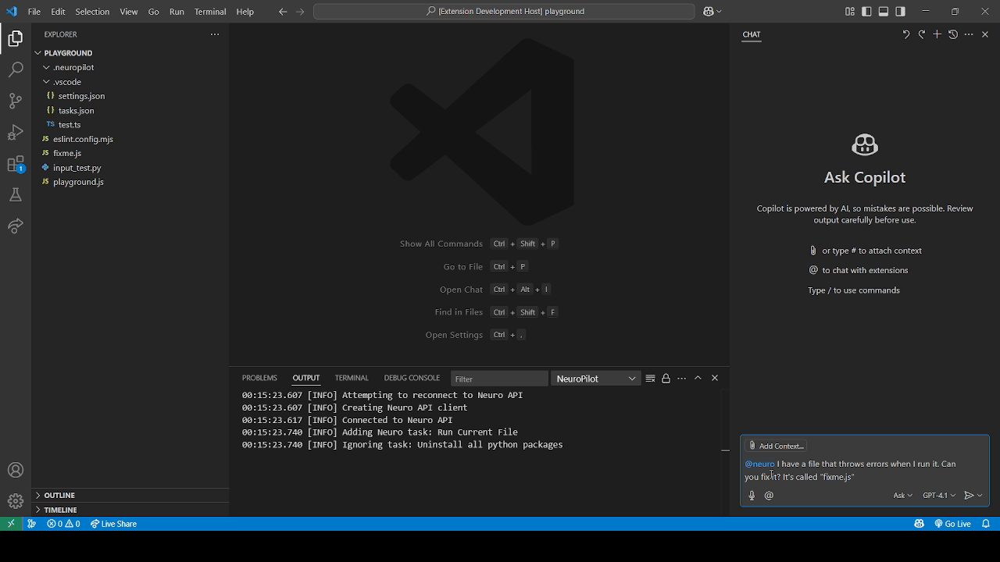

#  NeuroPilot

**Disclaimer: For simplicity, all mentions of Neuro also apply to Evil unless otherwise stated.**

This extension enables Neuro-sama to write code in Visual Studio Code, either together with a programmer or on her own.
If you don't have a Neuro-sama, you can use one of the tools listed [here](https://github.com/VedalAI/neuro-game-sdk/?tab=readme-ov-file#tools) and [here](https://github.com/VedalAI/neuro-game-sdk/?tab=readme-ov-file#tools-1) instead.

> [!CAUTION]
> Depending on the permissions you activate and which of the aforementioned testing tools / AIs you use, this extension can be quite destructive to your system. I do not take responsibility for any damages caused by this extension, neither do any contributors of this project. Use Copilot mode for dangerous permissions or use the extension on a virtual machine.

Capabilities of this extension include:

- letting Neuro make inline code suggestions.
- adding Neuro as a chat participant for Copilot Chat.
- letting Neuro edit the current file.
- letting Neuro read and open files in the workspace.
- letting Neuro create, rename and delete files in the workspace.
- letting Neuro run pre-defined tasks.
- letting Neuro interact with the git repository, if one is present in the open workspace.
- giving Neuro direct terminal access.
    <!-- - letting Neuro read what you type in real time. -->
    <!--
    Not sure about including this one - this was something she could *not* do in the past, but was later implemented and moved to the list of things she *could* do.
    (Also, this comment block is indented because it would cause formatting issues otherwise.)
    -->
- letting Neuro view linting diagnostics, and be updated on linting diagnostics as they come in.

These can all be turned on or off using the extension's permission settings.
All permissions are set to "Off" by default, [except one](vscode://settings/neuropilot.permission.requestCookies).

For more detailed documentation, visit [the docs site](https://vsc-neuropilot.github.io/neuropilot).

## How to use

On startup, the extension will immediately try to establish a connection to the Neuro API.
If the extension was started before the API was ready, or you lose connection to the API, you can use the command "NeuroPilot: Reconnect" from the Command Palette.

You can configure the extension using the extension settings.
For example, you can set how many lines of code will be provided as context before and after the current line.

There are two ways the extension can be used, which will be referred to as "Autopilot mode" and "Copilot mode".

### Autopilot Mode



To make Neuro able to code without human input, go to the extension settings and set the necessary permissions to "Autopilot", then run the command "NeuroPilot: Reload Permissions" from the Command Palette.
It is recommended to turn on auto-saving in the settings for this in case Neuro doesn't remember to save her files regularly.
Tasks that Neuro can run are loaded from `tasks.json`, but it requires some setup for Neuro to use them.
All tasks that Neuro should be able to run must have the string `[Neuro]` at the start of their `detail` property.
This is a safety measure so she doesn't have access to all tasks.

### Copilot Mode


Copilot mode aims to let Neuro code alongside the user, by letting her suggest code (like GitHub Copilot) and request to execute actions, which the user can allow or deny.

Instead of executing actions directly like in Autopilot Mode, a notification popup will appear asking you to confirm the action first.
The actions Neuro has access to and the permissions that govern them are the same as in Autopilot Mode.
Neuro can only request one action at a time, but she can also cancel it to request something else.

If you wish to use inline suggestions, you should add a keyboard shortcut for "Trigger Inline Suggestion" (`editor.action.inlineSuggest.trigger`) if you haven't already.
Once you are in a file, place your cursor where you want the new code to be inserted and trigger a suggestion.
This will send a command to Neuro asking her to complete the code.
You can also set it to trigger a completion every time you stop typing (this is fine for the tools like Randy, but might be a problem for Neuro since it sends and cancels requests in quick succession, which is why it's disabled by default).

> [!Note]
> If you are using Tony for testing, activating auto-answer is recommended, since completion requests are canceled if you click out of VS Code.

You can also use Copilot Chat to ask Neuro to generate code by specifying `@neuro` in the prompt.
This will bypass Copilot and instead send the prompt to Neuro, along with any selected references.

> [!Note]
> You can choose the name of the currently connected AI in the [Currently As Neuro API](vscode://settings/neuropilot.currentlyAsNeuroAPI) setting. This can change the @ you need to specify (Evil gets her own `@evil`, and any other name, including the simulator names such as Randy, uses `@neuroapi`.)
> However, if you, for example, type `@neuroapi`, then change the setting to either `Neuro` or `Evil`, then it will not automatically change the @, and will send the prompt to GitHub Copilot (who will be confused).

Unfortunately, "Trigger Inline Suggestion" will trigger all completion providers, and since Copilot is required for the Copilot Chat window, you cannot simply disable it.
There is a workaround however, by editing your User/Workspace Settings to make Copilot unable to talk to the API.
Simply paste this into your `settings.json` file:

```json
"github.copilot.advanced": {
    "debug.overrideEngine": "someRandomString"
}
```

### Mixing Autopilot and Copilot Mode

Autopilot and Copilot mode can be configured separately for each permission.
For example, you can configure it so Neuro can edit files by herself, but has to ask permission to run the code she wrote.

### Continuous Context Updates


Neuro will be updated on certain events not directly triggered by the user that happen in the workspace.
She will be notified when:

- a file is saved (only if [Auto Save](vscode://settings/files.autoSave) is not set to `afterDelay`)
- the Auto Save setting is modified
- lint problems occur (controlled by the setting [Send New Linting Problems On](vscode://settings/neuropilot.sendNewLintProblemsOn))
- a terminal that Neuro started produces more output
- a terminal started by Neuro exits
- a Copilot mode request times out
- a task that Neuro started finishes

## Security

The extension has multiple security measures in place to prevent Neuro from doing any real damage.
As said earlier, Neuro can only run tasks that have the string `[Neuro]` at the start of their `detail` property to control what tasks Neuro can run.

Neuro cannot open, edit, or otherwise access files or folders that start with a dot (`.`), or files in such folders.
This is mainly to prevent her from opening `.vscode/tasks.json` to essentially run arbitrary commands in the terminal, or editing `.vscode/settings.json` to escalate her permissions.
**Warning: If your workspace is inside such a folder, Neuro will not be able to edit *any* files!**

You can customise what directories are included in the list using the [*Include Pattern*](vscode://settings/neuropilot.includePattern) and [*Exclude Pattern*](vscode://settings/neuropilot.excludePattern), and you can disable the default directory checks using [*Allow Unsafe Paths*](vscode://settings/neuropilot.allowUnsafePaths).

Neuro also can't change the global git configuration, only the one local to the current repository.

Note that if Neuro has direct terminal access, you should assume all security features are pretty much out the window, since she can just rewrite the settings file and run whatever commands she wants.

The same advice applies for ticking the [*Neuropilot: Allow Unsafe Paths*](vscode://settings/neuropilot.allowUnsafePaths) setting if you gave Autopilot-level permissions to Neuro for editing files.

You can find more security advice on the docs site, linked above.

## Commands

We've moved this to the docs site. See above page.

## Actions

The following are all actions that Neuro has access to.
Note that Neuro can only use an action if the relevant permission is enabled.
If a permission level is set to Copilot, commands associated with that permission level first send a request to VS Code, which you can review, then allow/deny, using the NeuroPilot icon in the bottom bar.
The icon will be highlighted if a request is pending.
If you choose to disable the [Hide Copilot Requests](vscode://settings/neuropilot.hideCopilotRequests) setting, the notification will be displayed as soon as a request comes in.
If an action requires multiple permissions, the minimum permission level is used (Autopilot > Copilot > Off).

### Miscellaneous

#### `cancel_request`

Only registered if she is requesting to execute a Copilot-level command.
Allows Neuro to cancel her request.
If the notification was acted upon after cancelling, no response will be returned to either side.

#### `request_cookie`

*Requires Permission: [Request Cookies](vscode://settings/neuropilot.permission.requestCookies)*

Lets Neuro request a cookie from Vedal.
She can also request a specific flavor.

### Tasks

Tasks that Neuro can run are registered as additional actions with the normalized label of the task as the action name.
The task's `detail` becomes the action description if it exists, otherwise the task label is used.
Neuro can only run one task at a time.

#### `terminate_task`

*Requires Permission: [Run Tasks](vscode://settings/neuropilot.permission.runTasks).*

Terminates the currently running task that was started using a task action.

### File Interactions

Actions that allow Neuro to view and edit files in the workspace.

#### `get_files`

*Requires Permission: [Open files](vscode://settings/neuropilot.permission.openFiles).*

Gets a list of files in the workspace.
What files Neuro can see can be configured with the settings [*Include Pattern*](vscode://settings/neuropilot.includePattern) and [*Exclude Pattern*](vscode://settings/neuropilot.excludePattern).
The files are returned as paths relative to the workspace root.

#### `open_file`

*Requires Permission: [Open files](vscode://settings/neuropilot.permission.openFiles).*

Opens a file inside the workspace (or focuses it if it is already open) and sends its contents to Neuro.

#### `place_cursor`

*Requires Permission: [Edit Active Document](vscode://settings/neuropilot.permission.editActiveDocument).*

Places the cursor at the specified line and column or moves the cursor by the specified number of lines and columns.

#### `get_cursor`

*Requires Permission: [Edit Active Document](vscode://settings/neuropilot.permission.editActiveDocument).*

Returns the current cursor position, as well as the lines before and after the cursor.
The number of lines returned can be controlled with the settings [*Before Context*](vscode://settings/neuropilot.beforeContext) and [*After Context*](vscode://settings/neuropilot.afterContext).

#### `insert_text`

*Requires Permission: [Edit Active Document](vscode://settings/neuropilot.permission.editActiveDocument).*

Inserts text at the current cursor position and places the cursor after the inserted text.

#### `replace_text`

*Requires Permission: [Edit Active Document](vscode://settings/neuropilot.permission.editActiveDocument).*

Searches the current file for a search string or regex and replaces it.
If using regex, the replacement can use substitution patterns.
If only one instance is replaced, places the cursor after the inserted text.

#### `delete_text`

*Requires Permission: [Edit Active Document](vscode://settings/neuropilot.permission.editActiveDocument).*

Searches the current file for a search string or regex and deletes it.
If only one instance is deleted, places the cursor where the text was.

#### `find_text`

*Requires Permission: [Edit Active Document](vscode://settings/neuropilot.permission.editActiveDocument).*

Searches the current file for a search string or regex.
Depending on the match mode, places the cursor at the location or returns all lines with matches.

#### `undo`

*Requires Permission: [Edit Active Document](vscode://settings/neuropilot.permission.editActiveDocument).*

Undoes the last editing action.
Only works if VS Code is focused.

#### `save`

*Requires Permission: Edit Active Document.*
Saves the currently open document.
Only registered if the [*Files: Auto Save*](vscode://settings/files.autoSave) setting isn't set to `afterDelay`.

#### `create_file`

*Requires Permission: [Create](vscode://settings/neuropilot.permission.create).*

Creates a new file in the workspace.
If [*Permission: Open Files*](vscode://settings/neuropilot.permission.openFiles) is given, the file is immediately opened.
The file name cannot start with a dot, and cannot be created in a folder that starts with a dot.

#### `create_folder`

*Requires Permission: [Create](vscode://settings/neuropilot.permission.create).*

Creates a new folder in the workspace.
A folder starting with a dot cannot be created this way unless [*Allow Unsafe Paths*](vscode://settings/neuropilot.allowUnsafePaths) is activated.

#### `rename_file_or_folder`

*Requires Permission: [Rename](vscode://settings/neuropilot.permission.rename).*

Renames a file or folder in the workspace.
This cannot rename to or from a name starting with a dot, or within a folder that starts with a dot, unless [*Allow Unsafe Paths*](vscode://settings/neuropilot.allowUnsafePaths) is activated.

#### `delete_file_or_folder`

*Requires Permission: [Delete](vscode://settings/neuropilot.permission.delete).*

Deletes a file or folder in the workspace.
This cannot delete anything starting with a dot, or inside a folder starting with a dot, unless [*Allow Unsafe Paths*](vscode://settings/neuropilot.allowUnsafePaths) is activated.

### Git Interactions

Actions that allow Neuro to use Git for version control.

In addition to requiring their respective permissions, the extension will also check for an existing repo before registering actions other than `init_git_repo`.

Because this relies on the built-in Git extension, this extension will first check for the Git extension before attempting to execute each handler.

#### `init_git_repo`

*Requires Permission: [Git Operations](vscode://settings/neuropilot.permission.gitOperations).*

Initialises a Git repository in the workspace folder and registers other git commands.
The local repository will be reinitialised if a git repository already exists.

#### `add_file_to_git`

*Requires Permission: [Git Operations](vscode://settings/neuropilot.permission.gitOperations).*

Adds a file to Git's staging index.

#### `remove_file_from_git`

*Requires Permission: [Git Operations](vscode://settings/neuropilot.permission.gitOperations).*

Removes a file from Git's staging index.

#### `make_git_commit`

*Requires Permission: [Git Operations](vscode://settings/neuropilot.permission.gitOperations).*

Makes a commit. Messages are prefixed to differentiate between Neuro committing and the user committing.

#### `git_status`

*Requires Permission: [Git Operations](vscode://settings/neuropilot.permission.gitOperations).*

Returns the current status of the workspace.

#### `diff_files`

*Requires Permission: [Git Operations](vscode://settings/neuropilot.permission.gitOperations).*

Returns the diff between files.

#### `merge_to_current_branch`

*Requires Permission: [Git Operations](vscode://settings/neuropilot.permission.gitOperations).*

Merges another branch into the current branch.
If the branch cannot be merged cleanly, [`abort_merge`](#abort_merge) is registered.

#### `abort_merge`

*Requires Permission: [Git Operations](vscode://settings/neuropilot.permission.gitOperations).*

Aborts a merge currently in progress.
Only registered if a merge failed to happen cleanly.

#### `git_log`

*Requires Permission: [Git Operations](vscode://settings/neuropilot.permission.gitOperations).*

Returns the commit history of the current branch.

#### `git_blame`

*Requires Permission: [Git Operations](vscode://settings/neuropilot.permission.gitOperations).*

Returns commit attributions for each line in a file.

#### `tag_head`

*Requires Permission: [Git Operations](vscode://settings/neuropilot.permission.gitOperations) & [Git Tags](vscode://settings/neuropilot.permission.gitTags).*

Tags the commit currently at HEAD.

#### `delete_tag`

*Requires Permission: [Git Operations](vscode://settings/neuropilot.permission.gitOperations) & [Git Tags](vscode://settings/neuropilot.permission.gitTags).*

Deletes an existing tag.

#### `new_git_branch`

*Requires Permission: [Git Operations](vscode://settings/neuropilot.permission.gitOperations).*

Creates a new git branch and switches to it.

#### `switch_git_branch`

*Requires Permission: [Git Operations](vscode://settings/neuropilot.permission.gitOperations).*

Switches to an existing branch.

#### `delete_git_branch`

*Requires Permission: [Git Operations](vscode://settings/neuropilot.permission.gitOperations).*

Deletes a branch from the repository.
Branches that are not fully merged have to be deleted with the `force` parameter.

#### `fetch_git_commits`

*Requires Permissions: [Git Operations](vscode://settings/neuropilot.permission.gitOperations) & [Git Remotes](vscode://settings/neuropilot.permission.gitRemotes).*

Fetches info about missing commits from the specified/default remote.

#### `pull_git_commits`

*Requires Permissions: [Git Operations](vscode://settings/neuropilot.permission.gitOperations) & [Git Remotes](vscode://settings/neuropilot.permission.gitRemotes).*

Pulls new git commits from the specified or default remote.

#### `push_git_commits`

*Requires Permissions: [Git Operations](vscode://settings/neuropilot.permission.gitOperations) & [Git Remotes](vscode://settings/neuropilot.permission.gitRemotes).*

Pushes local commits to the remote. If a remote branch is not set as the upstream, this will automatically do so.

#### `add_git_remote`

*Requires Permissions: [Git Operations](vscode://settings/neuropilot.permission.gitOperations), [Git Remotes](vscode://settings/neuropilot.permission.gitRemotes) & [Edit Remote Data](vscode://settings/neuropilot.permission.editRemoteData).*

Adds a new git remote.

#### `remove_git_remote`

*Requires Permissions: [Git Operations](vscode://settings/neuropilot.permission.gitOperations), [Git Remotes](vscode://settings/neuropilot.permission.gitRemotes) & [Edit Remote Data](vscode://settings/neuropilot.permission.editRemoteData).*

Removes a git remote.

#### `rename_git_remote`

*Requires Permissions: [Git Operations](vscode://settings/neuropilot.permission.gitOperations), [Git Remotes](vscode://settings/neuropilot.permission.gitRemotes) & [Edit Remote Data](vscode://settings/neuropilot.permission.editRemoteData).*

Renames a git remote. This only changes the name of the remote, not the URL.

#### `get_git_config`

*Requires Permissions: [Git Operations](vscode://settings/neuropilot.permission.gitOperations) & [Git Configs](vscode://settings/neuropilot.permission.gitConfigs).*

Gets a key's value from the git configuration. Neuro can only see the repository's configurations, never global configs.
If no key is specified, returns the entire git config.

#### `set_git_config`

*Requires Permissions: [Git Operations](vscode://settings/neuropilot.permission.gitOperations) & [Git Configs](vscode://settings/neuropilot.permission.gitConfigs).*

Sets a key's value in the git configuration. Neuro can only change the repository's configurations, never global configs.

### Shell Interactions

Actions that allow Neuro to directly access the terminal.
Needless to say, this is very dangerous and circumvents pretty much all security measures built into the extension.

#### `execute_in_terminal`

*Requires Permission: [Terminal Access](vscode://settings/neuropilot.permission.terminalAccess).*

Executes a command into a shell process. The available shell processes can be configured in extension settings.
If the terminal isn't already running, it will also initialise a terminal instance with the specified shell.

#### `kill_terminal_process`

*Requires Permission: [Terminal Access](vscode://settings/neuropilot.permission.terminalAccess).*

Kills a running shell started by Neuro. If a shell isn't already running, Neuro will be notified.

#### `get_currently_running_shells`

*Requires Permission: [Terminal Access](vscode://settings/neuropilot.permission.terminalAccess).*

Returns the list of currently running shells started by Neuro to Neuro.

### Linting

Actions that let Neuro see linting problems reported by other extensions.

In addition to linting problems by built-in language servers (such as the JavaScript and TypeScript Language Server), problems informed by other language servers (e.g. Python extension) will also be sent to Neuro.

Access to linting problems is also limited to Neuro-safe paths.

#### `get_file_lint_problems`

*Requires Permissions: [Access Linting Analysis](vscode://settings/neuropilot.permission.accessLintingAnalysis).*

Returns the linting diagnostics list of a file to Neuro.
The file must have been loaded first before diagnostics are available.

#### `get_folder_lint_problems`

*Requires Permissions: [Access Linting Analysis](vscode://settings/neuropilot.permission.accessLintingAnalysis).*

Returns the linting diagnostics list of a folder's files to Neuro.
Note that this only returns diagnostics of files in that folder that are loaded in the current session.

#### `get_workspace_lint_problems`

*Requires Permissions: [Access Linting Analysis](vscode://settings/neuropilot.permission.accessLintingAnalysis).*

Returns the linting diagnostics list of the current workspace to Neuro.
Note that this only returns diagnostics of files that are loaded in the current session.

## Further Info

### Credits

This extension uses the [TypeScript/JavaScript SDK](https://github.com/AriesAlex/typescript-neuro-game-sdk) by [AriesAlex](https://github.com/AriesAlex).

Documentation by [@KTrain5169](https://github.com/KTrain5169).

Extension icon by Xaendril.

### Neuro's cursor

Assuming the [Edit Active Document](vscode://settings/neuropilot.permission.editActiveDocument) permission isn't set to `Off`, Neuro gains her own cursor, indicated by the pink cursor in text documents. This cursor will only appear in files she has access to (which is affected by the `Allow Unsafe Paths` and `Include`/`Exclude` Patterns settings.) and you can also move the cursor yourself using the aforementioned `Move Neuro's Cursor Here` command. This allows her to work on the same file as the programmer but without having to rely on the normal cursor, which solves some problems relating to their respective actions.

If you enable the [Cursor Follows Neuro](vscode://settings/neuropilot.cursorFollowsNeuro) setting, the normal cursor will automatically be moved to Neuro's cursor if she moves it.

### "Why is there a file named rce.ts in it??? Is there an intentional RCE inside this extension???" <!-- had to add this just in case -->

Copilot mode is developed for making Neuro request to do actions instead of directly allowing her to do that action.
This was called the **R**equested **C**ommand **E**xecution (or Request for Command Execution) framework when it was first conceived.
The short answer is no, there isn't an intentional Remote Code Execution vulnerability in this extension, but by enabling Neuro's access to Pseudoterminals, one could say she already has access to a very powerful RCE, so be careful with that one.

## Debugging

- Clone the repository
- Run `npm install` in terminal to install dependencies
- Run the `Run Extension` target in the Debug View. This will:
  - Start a task `npm: watch` to compile the code
  - Run the extension in a new VS Code window

## Contributing

If you have an idea or want to contribute a feature, please first [create an issue](https://github.com/VSC-NeuroPilot/neuropilot/issues) or send a message to `@Pasu4` in the project's [post on the Neuro Discord](https://discord.com/channels/574720535888396288/1350968830230396938).
If you make a pull request that contributes code, please run `npm run lint src` and resolve any errors that did not get auto-fixed, preferrably before each commit.
